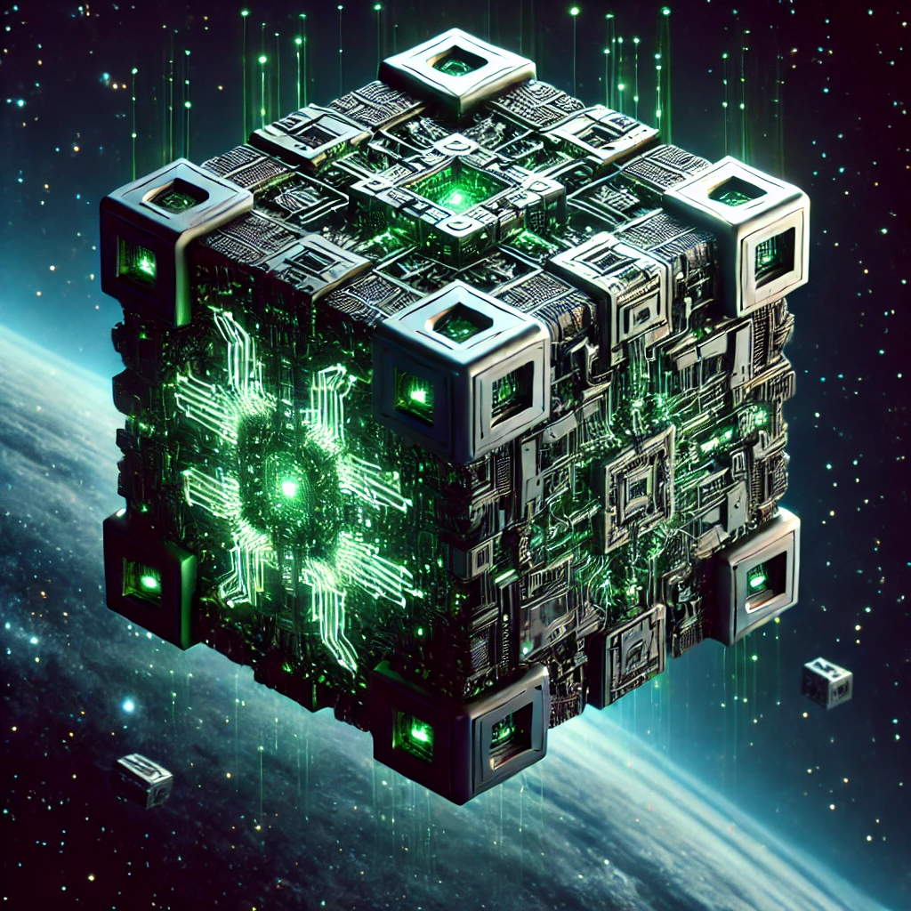

# BorgVR

BorgVR stands for Bricked Out Of Core Ray Guided Volume Rendering in Virtual Reallity and is is a high-performance, large-scale, mixed-reality, out-of-core, [ray-guided](https://en.wikipedia.org/wiki/Ray_tracing_(graphics)), [volume rendering](https://en.wikipedia.org/wiki/Volume_rendering) project. This project is developed by the [Computergraphics and Visualization Group](https://www.cgvis.de/) at the University of Duisburg-Essen and targets the **Apple Vision Pro Spatial Computing platform**. BorgVR aims to push the boundaries of [mixed reality](https://en.wikipedia.org/wiki/Mixed_reality) and [virtual reality (VR)](https://en.wikipedia.org/wiki/Virtual_reality) by leveraging advanced GPU-based volume visualization techniques for spatial computing.

---

## Overview

BorgVR extends the capabilities of volume rendering to mixed reality, specifically designed to harness the power of Apple Vision Pro. The system employs cutting-edge techniques in out-of-core raycasting to render complex, large-scale volumetric datasets seamlessly. BorgVR is built to meet the computational demands of spatial computing environments, offering a unique experience for high-fidelity visualization in VR and MR settings.

### Key Features

- **High-Performance Volume Rendering**: Optimized for Apple Vision Pro, designed to provide smooth and immersive volume visualization.
- **Out-of-Core Data Handling**: Efficient management and rendering of massive datasets, suitable for high-resolution visualization and simulation.
- **Ray-Guided Volume Rendering**: Advanced ray-guided techniques for interactive visualization, supporting intuitive exploration of volumetric data in 3D space.
- **GPU Acceleration**: Full utilization of Apple Vision Pro’s GPU capabilities to support real-time, spatially immersive rendering.

---

## Research Basis

BorgVR is grounded in the following research publications. The full list of publications can be found on our [publications page](https://www.cgvis.de/publications.shtml).

1. **Investigating the Apple Vision Pro Spatial Computing Platform for GPU-Based Volume Visualization**  
   *Camilla Hrycak, David Lewakis, Jens Krüger*  
   *Proceedings of the IEEE VIS 2024 Conference*

2. **Embracing Raycasting for Virtual Reality**  
   *Andre Waschk, Jens Krüger*  
   *30th International Conference on Computer Graphics, Visualization and Computer Vision, WSCG 2022*

3. **FAVR - Accelerating Direct Volume Rendering for Virtual Reality Systems**  
   *Andre Waschk, Jens Krüger*  
   *2020 IEEE Visualization Conference (VIS)*

4. **Mobile Computational Steering for Interactive Prediction and Visualization of Deep Brain Stimulation Therapy**  
   *Johannes Vorwerk, Andrew Janson, Alexander Schiewe, Jens Krüger, Christopher R. Butson*  
   *Medical Image Analysis and Visualization Workshop, Supercomputing 2016*

5. **Mobile Decision Support System for Nurse Management of Deep Brain Stimulation**  
   *Gordon Duffley, D. Martinez, Jens Krüger, B. Lutz, M.S. Okun, Christopher R. Butson*  
   *20th International Congress on Parkinson’s and Movement Disorders*

6. **Trinity: A Novel Visualization and Data Distribution System**  
   *Andrey Krekhov, Jens Krüger*  
   *GPU Technology Conference 2016*

7. **State of the Art in Mobile Volume Rendering on iOS Devices**  
   *Alexander Schiewe, Mario Anstoots, Jens Krüger*  
   *EuroVis 2015 Short Paper Proceedings*

8. **An Analysis of Scalable GPU-Based Ray-Guided Volume Rendering**  
   *Thomas Fogal, Alexander Schiewe, Jens Krüger*  
   *IEEE Large Scale Data Analysis and Visualization Symposium 2013*

9. **Evaluation of Interactive Visualization on Mobile Computing Platforms for Selection of Deep Brain Stimulation Parameters**  
   *Christopher Butson, Georg Tamm, Sanket Jain, Thomas Fogal, Jens Krüger*  
   *IEEE Transactions on Visualization and Computer Graphics, 19(1):108 - 117, January 2013*

10. **Tuvok - An Architecture for Large Scale Volume Rendering**  
    *Jens Krüger, Thomas Fogal*  
    *Proceedings of the 15th Vision, Modeling and Visualization Workshop 2010*

These works provide the foundation for BorgVR’s architecture, data handling, and rendering approach, advancing the field of volume visualization and raycasting for immersive spatial computing applications.

---

## Installation

To get started with BorgVR, ensure that you have access to an Apple Vision Pro development environment with Xcode and all necessary Apple developer tools.

1. **Clone the repository**:
   ```bash
   git clone https://github.com/JensDerKrueger/BorgVR.git
   cd BorgVR
   ```

2. **Install dependencies**:
   Run the provided setup script or install required packages manually based on the dependencies outlined in `requirements.txt`.

3. **Build and Run**:
   Use the Xcode project provided to build and deploy BorgVR on the Vision Pro platform.

---

## Usage

BorgVR is designed for research and educational use in high-performance visualization projects. Once deployed, it provides an interactive UI for volume exploration and manipulation, with support for loading custom volumetric datasets. Additional tools and settings are accessible through the application’s main interface, optimized for Apple Vision Pro’s spatial computing environment.

---

## Contributing

We welcome contributions from researchers and developers interested in high-performance volume rendering. Please see `CONTRIBUTING.md` for guidelines on how to contribute to BorgVR.

---

## License

BorgVR is released under the [MIT License](LICENSE).

---

## Contact

For questions or further information, please reach out to the Computergraphics and Visualization Group at the University of Duisburg-Essen. Detailed contact information is available on our [official website](https://www.cgvis.de/).

---

## Acknowledgments

This project builds on years of research and development in volume rendering and spatial computing. We are grateful to all researchers and contributors whose work has made BorgVR possible, especially those whose publications have provided a foundation for this project’s algorithms and optimizations. A special thanks to the Apple Vision Pro team for creating a hardware platform that enables next-generation visualization experiences in spatial computing.

We would also like to acknowledge the funding and support from the University of Duisburg-Essen and the collaborators and contributors to the IEEE VIS and WSCG conferences, as well as the Supercomputing and EuroVis workshops.

## Additional Resources

### Documentation

Comprehensive documentation, including API references, usage examples, and a developer's guide, can be found in the `docs` folder. Start with `docs/Getting_Started.md` for an introduction to the system architecture and basic usage.

### Tutorials

Example datasets and hands-on tutorials are provided to help users get up and running quickly. Visit the `examples` folder in the repository for sample projects, including real-world volume data and visualization cases.

### Related Projects

If you're interested in similar work, check out the following related projects by the Computergraphics and Visualization Group:

- **Tuvok**: Large-scale volume rendering architecture
- **Trinity**: Data distribution and visualization system for GPUs
- **FAVR**: Accelerated volume rendering for VR environments

---

## Future Work

BorgVR is an active research project, and we aim to continually improve its performance and feature set. Future plans include:

- **Enhanced Data Streaming**: Improving out-of-core data handling for larger datasets in real-time.
- **Cross-Platform Support**: Exploring compatibility with other spatial computing devices.
- **User Interaction Enhancements**: Adding more immersive controls and interaction capabilities in the mixed-reality environment.
- **Optimized Memory Management**: Further optimizing memory allocation and management on GPU resources to improve rendering efficiency.

Your feedback and contributions are invaluable in shaping the future of BorgVR. Join us on this journey to advance high-fidelity, large-scale, interactive volume visualization in mixed reality.

---

Thank you for using and supporting BorgVR!

**The BorgVR Team**  
Computergraphics and Visualization Group  
University of Duisburg-Essen
