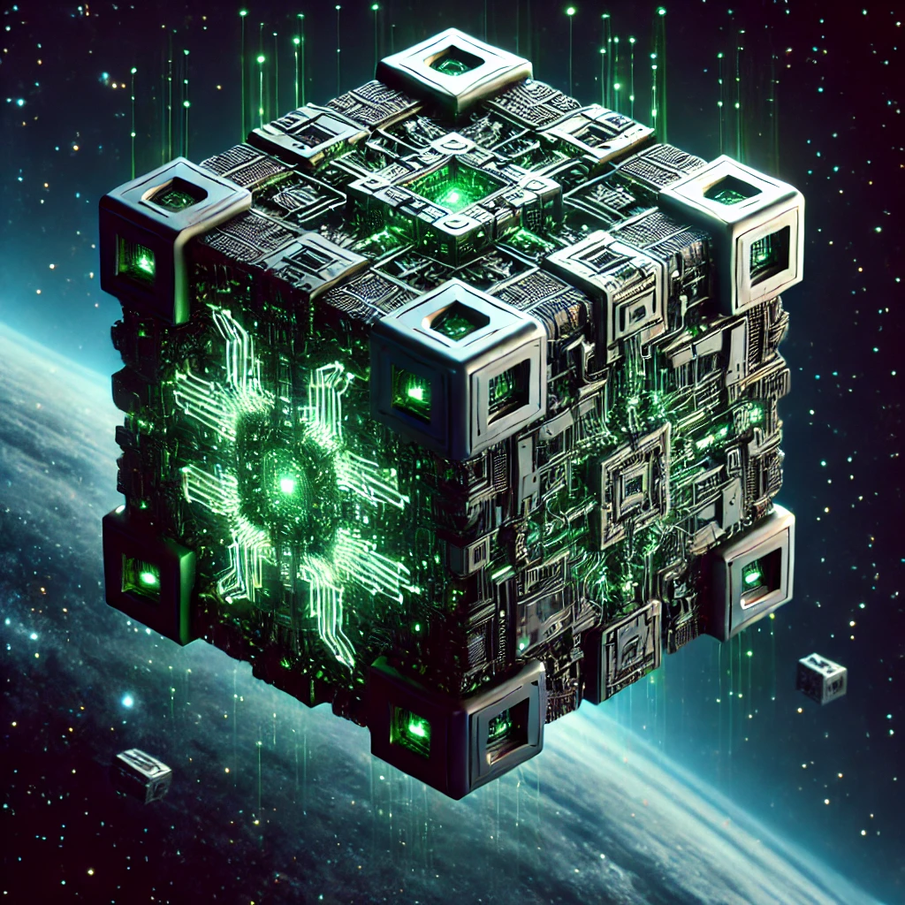

<p align="center">
  
</p>

# BorgVR

BorgVR is a bricked, out-of-core, ray-guided volume rendering system developed by the
[Computer Graphics and Visualization Group](https://www.cgvis.de/) at the University of
Duisburg-Essen. It started as a native Apple Vision Pro renderer and has since grown into
a family of native applications for **visionOS**, **iOS/iPadOS**, and **macOS**, accompanied
by Swift and C++ dataset servers and a WebGPU browser renderer.

The project is intended for interactive exploration of large volumetric datasets. It combines
native Metal renderers, dataset conversion tools, local and remote dataset servers, SharePlay
collaboration, and a WebGPU browser frontend served directly by the dataset server.

The current development version is **2.7**. The SharePlay wire protocol remains at version
**2.6** because application and collaboration-protocol versions advance independently.

## What Is Included

- **VisionApp**: native visionOS volume renderer with spatial interaction, SharePlay, annotations,
  measurements, Logitech Muse, and PlayStation VR2 Sense controller support.
- **iOSApp**: adaptive native iPhone and iPad volume renderer with local and remote datasets,
  SharePlay, annotations, and measurements.
- **macOSApp**: native Mac renderer with import/export tools, scripting, dockable editors,
  annotations, measurements, and an optional background server.
- **macOSServer**: Mac GUI for dataset conversion, serving, and server-to-server synchronization.
- **TerminalServerApp**: command-line dataset server.
- **TerminalConverterApp**: command-line dataset conversion tool.
- **BORGVRServerCPP**: cross-platform C++17 implementation of the dataset server protocol,
  including synchronization and the embedded WebGPU frontend.
- **web**: responsive WebGPU renderer served directly by a BorgVR server.
- **html**: static support, privacy, and landing pages for app distribution.

## Features

### Rendering

- Bricked out-of-core rendering of volumes larger than GPU memory.
- Native Metal raycasters on visionOS, iOS/iPadOS, and macOS, plus a WebGPU browser renderer.
- Transfer-function, illuminated transfer-function, isosurface, clipping, LOD, and adaptive
  sampling controls.
- Configurable ambient, diffuse, and specular lighting with an interactive light-direction
  arcball, shared across native clients and WebGPU.
- GPU-guided brick requests with progressive paging into a brick atlas.
- Interactive transfer-function editors and persistent transfer-function catalogs.
- Physical voxel spacing is preserved through import and LoD generation. Dataset information
  reports real-world extents using suitable metric units while rendering remains normalized.

### Collaboration

- SharePlay collaboration with synchronized datasets, transforms, rendering parameters,
  transfer functions, lighting, markers, and measurements.
- Protocol-version negotiation rejects incompatible clients with an actionable minimum-version
  message before rendering state is exchanged.
- Named and color-coded participants, shared or private screen views for iOS and macOS clients,
  and spatial screen-view visualization and manipulation on Apple Vision Pro.
- Host handover, explicit leave/waiting states, and synchronized initial state for participants
  joining an active session.
- Optional ad-hoc dataset servers and a persistent origin catalog. Participants exchange known
  sources, retry unavailable endpoints, and can recover an active remote renderer through another
  server that provides the same dataset.

### Markers And Spatial Input

- Named and colored spherical markers on all native clients and in WebGPU.
- Directional sphere markers and tube-rendered stroke markers with a shared binary `.marker`
  format and dataset identity checks.
- Multi-selection, marker import/export, server catalogs, editing, and synchronized initial state
  for new SharePlay participants.
- Hand-based marker placement on Apple Vision Pro, including configurable quick markers.
- Logitech Muse spatial-stylus drawing on visionOS 26 or newer, with live stroke radius and
  color controls, pressure-sensitive drawing, and selectable marker or measurement tools.
- Independent left- and right-hand PlayStation VR2 Sense controller tools with configurable
  button actions, volume manipulation, stroke drawing, measurement, and shared tip previews.

### Measurements

- Interactive polyline length, planar convex-area, and convex-volume measurements on visionOS,
  iOS/iPadOS, and macOS using physical dataset dimensions.
- Editable control points, real-time values with automatically selected metric units, and
  rendering integrated with the volume depth/compositing pipeline.
- Measurement synchronization through SharePlay and a dataset-aware binary `.measurement`
  format for local save/load workflows.
- Direct hand, Logitech Muse, and PlayStation VR2 Sense controller measurement interaction on
  Apple Vision Pro.

### Data And Servers

- Dataset import and conversion from BorgVR, QVIS, NRRD/NHDR, PVM/PVM2/PVM3, and DICOM workflows,
  including physical DICOM spacing.
- BorgVR datasets can be exported at any stored LoD as a flat, uncompressed NRRD volume while
  retaining the corresponding voxel spacing.
- Password-protected Swift and C++ dataset servers serving datasets, transfer functions,
  and marker files.
- Periodic server-to-server synchronization in the macOS server and C++ server, including
  resumable downloads of incomplete datasets.
- Optional HTTPS WebGPU hosting from the Swift server with generated self-signed certificates
  or imported PKCS#12 identities.
- Resilient remote paging reconnects interrupted streams, repeats complete brick transactions,
  validates replacement-source metadata, and resumes incomplete local caches.

### macOS Automation

- Drag-and-drop `.gsc` scripts with a live execution log and repeatable interaction, rendering,
  and screenshot commands.
- The companion [Graphics Script Editor](https://github.com/JensDerKrueger/GraphicsScriptEditor)
  provides a graphical environment for conveniently creating and editing `.gsc` scripts for the
  macOS renderer.
- Synchronous text, file, and directory input functions for interactive scripts.
- Scriptable QVIS, NRRD, PVM, and DICOM import, BorgVR LoD export, and configurable import
  brick size, overlap, and border handling.

### WebGPU

- Responsive desktop and mobile UI with touch interaction and shareable renderer URLs.
- Optional persistent brick cache backed by IndexedDB, including cache statistics and clearing.
- Dataset-specific transfer-function and marker catalogs loaded from the server.
- Sphere and tube-mesh marker rendering.

## Repository Layout

```text
AppSupport/             Shared Swift UI, renderer support, shaders, settings, and WebGPU assets
BORGVR-IO/              Dataset readers, metadata, raw access, and conversion helpers
BORGVR-Render/          Metal rendering infrastructure
BORGVR-Services/        Swift TCP dataset server and HTTP/WebGPU server
BORGVRServerCPP/        C++ dataset server implementation
VisionApp/              visionOS app target
iOSApp/                 iPhone and iPad app target
macOSApp/               macOS renderer app target
macOSServer/            macOS server/converter app target
TerminalServerApp/      Swift command-line dataset server
TerminalConverterApp/   Swift command-line converter
web/                    WebGPU browser frontend
html/                   App support/privacy website pages
Scripts/                Example macOS scripting files and command definitions
TransferFunctions/      Bundled transfer-function presets
```

## Building

### Requirements

- Xcode with the SDK required by the selected target. The current project targets iOS/iPadOS
  17.0 or newer, macOS 15.2 or newer, and visionOS 26.0 or newer.
- Apple development signing for device and App Store builds.
- A C++17 compiler and `make` for the standalone C++ server on macOS or Linux. A Visual Studio
  solution is also included for Windows.
- A browser with WebGPU support for the browser renderer. WebGPU on iPhone and iPad requires
  iOS/iPadOS 26 or newer.

### Apple Applications

Open `BorgVR.xcodeproj` in Xcode and select the scheme for the platform you want to build.

Common schemes:

- `VisionApp`
- `VisionApp Release`
- `iOSApp`
- `iOSApp Release`
- `macOSApp`
- `macOSApp Release`
- `macOSServer`
- `macOSServer Release`
- `TerminalServerApp`
- `TerminalConverterApp`

For App Store or device builds, configure your Apple development team and signing settings in Xcode.
The project uses the shared bundle identifier configured in the Xcode project.

### Command-Line Volume Generator

The `TerminalConverterApp` scheme converts DICOM, QVIS, NRRD, and PVM input, exports any LoD of a
BorgVR dataset as a flat volume, and can create reproducible synthetic volumes. Export uses one
deliberately simple interchange representation: an uncompressed inline NRRD file.

```sh
TerminalConverterApp E <input.data> <output.nrrd> <lod>
```

LoD `0` reconstructs the full-resolution source volume. Higher LoDs export the stored downsampled
levels while preserving their corresponding physical voxel spacing. Importing and exporting works
for one- and multi-component data with 1-, 2-, or 4-byte components.

The creation mode has this general form:

```sh
TerminalConverterApp C <algorithm> <bytes-per-component> <components> \
  <size-x> <size-y> <size-z> <output.data> <description> <brick-size> <overlap>
```

The following algorithm identifiers are available:

- `L`: linear test data
- `F`: single-precision Mandelbulb, accelerated with Metal when available
- `D`: double-precision Mandelbulb on the CPU
- `J`: detailed asymmetric quaternion Julia-set slice
- `B`: Mandelbox
- `G`: periodic gyroid field
- `P`: 3D Shepp-Logan phantom
- `T`: frequency chirp with a calibration region aligned to the generated brick boundaries

The analytical generators run slice by slice on Metal and automatically fall back to a
multithreaded CPU implementation. They support one-component 8-, 16-, and 32-bit output. The Julia
preset suppresses its early, nearly spherical escape bands so that the later fractal structures
occupy the useful value range. For example, this creates a 16-bit `512³` Julia volume:

```sh
TerminalConverterApp C J 2 1 512 512 512 QuaternionJulia.data \
  "Quaternion Julia set" 64 2
```

Use `TerminalConverterApp --help` for the complete argument list.

PVM import accepts PVM, PVM2, and PVM3 streams, including the `DDS v3d` and block-interleaved
`DDS v3e` wrappers. The decoder is implemented directly in BorgVR. Because PVM spacing is
relative rather than an absolute physical unit, BorgVR preserves its proportions and normalizes
the longest dataset extent to one meter during import.

### Swift Dataset Server

The `TerminalServerApp` scheme builds the standalone Swift server. It serves datasets, transfer
functions, and marker files from one directory and refreshes that catalog every ten seconds by
default. For example:

```sh
TerminalServerApp --directory /path/to/datasets --port 12345 --web-port 8080
```

`--web-port` also starts the bundled WebGPU frontend. It uses HTTPS with a temporary self-signed
certificate by default; use `--web-http` for localhost-only HTTP or `--web-certificate` to supply a
PKCS#12 certificate. Password protection applies to both protocols. Run
`TerminalServerApp --help` for certificate, scan-interval, brick-batch, and file-logging options.

Remote BorgVR servers can be synchronized into the same directory. The option is repeatable, and
the optional password is never printed by the server:

```sh
TerminalServerApp --directory /srv/borgvr \
  --sync-server server-a.example 12345 300 secret \
  --sync-server server-b.example 12345 300
```

Synchronization includes datasets, transfer functions, and marker files. When more than one
configured server offers a dataset, another source is tried if the current transfer stalls.

### C++ Dataset Server

Build the standalone server on macOS or Linux with:

```sh
cd BORGVRServerCPP
make
```

The build first compiles a small C++ bootstrap tool that packages the current `web` directory as
LZ4-compressed embedded assets. `src/GeneratedWebAssets.cpp` and
`src/GeneratedWebAssets.h` are generated build inputs and are intentionally not tracked.

Run `make CONFIG=debug` for a debug build or, for example:

```sh
make run ARGS="--directory /path/to/datasets --port 12345 --max-bricks 64 --web-port 8080"
```

The Swift and C++ command-line servers use the same option names for their shared features. See the
server's command-line help for password, scan interval, WebGPU port, sync-server, and `--log-file`
options. While either server is running, enter `l` to list its current datasets, `l0` through `l3`
to select developer/debug, info, warning, or error output, `r` to refresh the catalog, `h` for
console help, or `q` to stop it.

### Apple Vision Pro Development

Short setup notes for pairing and enabling development on Apple Vision Pro are kept in
[`readme.txt`](readme.txt).

## Dataset Server And WebGPU Frontend

BorgVR can expose datasets through its native server protocol. The Swift server can also start a
small HTTP/HTTPS server that serves the WebGPU frontend and dataset resources to a browser. Both
server implementations publish compatible dataset, transfer-function, and marker catalogs.

The WebGPU server is disabled by default. When enabled, HTTPS is enabled by default because remote
browser WebGPU access generally requires a secure context. If no certificate is configured, BorgVR
creates a temporary self-signed certificate at server startup. A custom `.p12` or `.pfx`
certificate can be imported in the app settings; its password is stored in the system Keychain.
For safety, plain HTTP binds to `localhost` only. HTTPS listens on the local network so browsers
on other devices can use WebGPU through a secure context. Use a reverse proxy such as nginx if you
intentionally want to expose it outside the local network.

The WebGPU frontend supports the main rendering modes, transfer-function editing, object placement
files with spheres, strokes, instanced textured meshes, locally loaded measurement files, touch
controls, and optional persistent caching of downloaded bricks in IndexedDB. Referenced mesh assets
are resolved through the server mesh catalog. Browser storage is scoped to the server origin and can
be disabled or cleared from the renderer settings. The native apps remain the primary
high-performance and spatial rendering applications.

## Data Files

BorgVR uses four application-specific file types:

- `.data`: metadata followed by bricked, optionally compressed volume data.
- `.tf1d`: one-dimensional transfer functions and their display metadata.
- `.marker`: binary directional sphere and stroke annotations, including the unique ID of their
  source dataset.
- `.measurement`: binary length, area, and volume measurements associated with a source dataset.

Loading markers or measurements created for another dataset requires explicit confirmation. The
repository includes small sample datasets for testing. Larger datasets should be kept outside the
repository and served or opened from a local data directory.

## Research Background

BorgVR builds on several years of work on GPU volume rendering, ray-guided rendering, mobile
visualization, and virtual-reality visualization systems. Related publications include:

1. **An Investigation of the Apple Vision Pro for Out-of-Core Ray-Guided Volume Rendering with BorgVR**:
   [Camilla Hrycak](https://www.cgvis.de/hrycak.shtml),
   [Jens Krüger](https://www.cgvis.de/krueger.shtml), Proceedings of the 30th Vision, Modeling and
   Visualization Workshop 2025

2. **Investigating the Apple Vision Pro Spatial Computing Platform for GPU-Based Volume Visualization**:
   [Camilla Hrycak](https://www.cgvis.de/hrycak.shtml),
   [David Lewakis](https://ieeexplore.ieee.org/author/936221321374789),
   [Jens Krüger](https://www.cgvis.de/krueger.shtml), IEEE VIS 2024

3. **Embracing Raycasting for Virtual Reality**:
   [Andre Waschk](https://www.cgvis.de/waschk.shtml),
   [Jens Krüger](https://www.cgvis.de/krueger.shtml), WSCG 2022

4. **FAVR - Accelerating Direct Volume Rendering for Virtual Reality Systems**:
   [Andre Waschk](https://www.cgvis.de/waschk.shtml),
   [Jens Krüger](https://www.cgvis.de/krueger.shtml), IEEE VIS 2020

5. **State of the Art in Mobile Volume Rendering on iOS Devices**:
   [Alexander Schiewe](https://www.cgvis.de/schiewe.shtml),
   [Mario Anstoots](https://dblp.org/pid/224/2475.html),
   [Jens Krüger](https://www.cgvis.de/krueger.shtml), EuroVis 2015

6. **An Analysis of Scalable GPU-Based Ray-Guided Volume Rendering**:
   [Thomas Fogal](https://www.cgvis.de/fogal.shtml),
   [Alexander Schiewe](https://www.cgvis.de/schiewe.shtml),
   [Jens Krüger](https://www.cgvis.de/krueger.shtml), IEEE LDAV 2013

More publications are listed on the [CGVIS publications page](https://www.cgvis.de/publications.shtml).

## License

BorgVR is released under the [MIT License](LICENSE).

## Contact

Computer Graphics and Visualization Group
University of Duisburg-Essen
[https://www.cgvis.de/](https://www.cgvis.de/)
